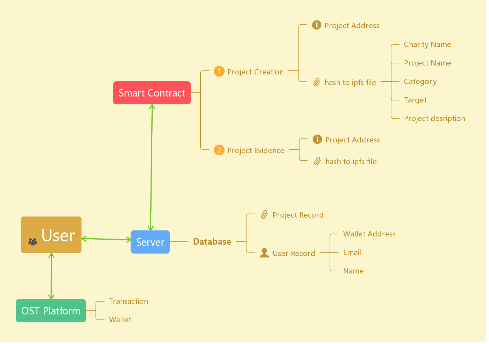

# Decentralized application(Dapp) with OST platform
*   Project demo for ISOM3000B Blockchain Entrepreneurship for Social Impact    
*   Simple prototype with limited amount of features

<table>
    <tr>
        <td>Client</td>
        <td>Java</td>
    </tr>
    <tr>
        <td>Server</td>
        <td>Go</td>
    </tr>
    <tr>
        <td>Database</td>
        <td>MongoDB</td>
    </tr>
    <tr>
        <td>Smart Contract</td>
        <td>Solidity</td>
    </tr>
</table>

Project Description:
<ul>
    <li>Branded token (the cryptocurrency wallet system)  provided by OST platform</li>
    <li>Ethereum Smart Contract, which provides permanent and immutable storage for charity project information</li>
    <li>Whenever a new project is submitted to the contract, a server built with Golang will automatically upload the project details to MongoDB for ease of access</li>
    <li>Client side built with Java displays all the available projects in the database and users can donate cryptocurrency to those projects by purchasing branded token from the platform</li>
    <li>Charity can upload prove of progress to ipfs (blockcahin file storage), and the hash will be storage in the smart contract for reference.</li>
</ul>

>Data flow and storage

    

>Demo video showing the prototype, which illustrates the user interaction using a mockup(UI) alongside with the implementated application.

>Since the prototype has to be done in less than 3 weeks time, the java implementation has a relatively simple and unfinish interface.

    

